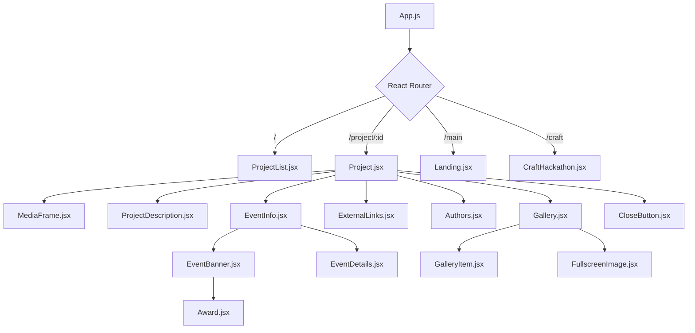

# Hackathon Portfolio

[](https://reactjs.org/)
[](https://reactrouter.com/)
[](https://www.marekk3301.pl/)
[]()

> Interactive portfolio showcasing hackathon projects, awards, certificates, and media galleries.

🔗 **Live Website:** [marekk3301.pl](https://www.marekk3301.pl/)

---

## 📖 Table of Contents

- [Overview](#-overview)
- [Tech Stack](#-tech-stack)
- [Key Features](#-key-features)
- [Architecture & Directory Structure](#-architecture--directory-structure)
- [Data Schema (`hackathons.json`)](#-data-schema-hackathonsjson)
- [Adding a New Hackathon Project](#-adding-a-new-hackathon-project)
- [Component Breakdown](#-component-breakdown)
- [Styling & Design System](#-styling--design-system)
- [Getting Started & Local Development](#-getting-started--local-development)
- [Build & Deployment](#-build--deployment)

---

## 🌟 Overview

This web application serves as a comprehensive portfolio cataloging my hackathon achievements, prototypes, multimedia presentations, and collaborative experiments.

---

## 🛠 Tech Stack

| Layer | Technology | Description |
| :--- | :--- | :--- |
| **Framework** | [React 18](https://react.dev/) (`^18.3.1`) | UI component library with Hooks and StrictMode |
| **Routing** | [React Router DOM v6](https://reactrouter.com/) (`^6.26.0`) | Client-side routing with `HashRouter` for GitHub Pages compatibility |
| **Styling** | Pure CSS3 / Modular CSS | CSS Grid, Flexbox, custom chromatic aberration glitch filters, Google Fonts |
| **Typography** | [Outfit](https://fonts.google.com/specimen/Outfit) | Modern geometric sans-serif loaded via Google Fonts |
| **Testing** | [Jest](https://jestjs.io/) & [React Testing Library](https://testing-library.com/) | Unit and component testing suite |
| **Deployment** | [`gh-pages`](https://www.npmjs.com/package/gh-pages) | Automated static site deployment to GitHub Pages |

---

## ✨ Key Features

- **Cyberpunk / Glitch Aesthetic:** Custom CSS chromatic aberration drop shadows, glowing text, dark mode canvas, and retro UI navigation controls.
- **Dynamic Project Grid (`/`):** Masked scrolling grid of interactive project icons with hover glitch effects and direct routing.
- **Multi-Modal Solution Previews:**
  - Embedded YouTube video players with custom styling
  - Direct HTML5 video playback
  - Static solution imagery
- **Award Badges & Certificate Verification:**
  - Dynamic vector trophy/medal badges for 1st, 2nd, 3rd place, Community, and Special awards
  - Direct links to official PDF certificates and diplomas hosted in the asset gallery
- **Interactive Lightbox Media Gallery:**
  - Grid layout of hackathon event photos and project captures
  - Single-click fullscreen lightbox image viewer
- **Expandable Project Overviews:** Truncated text with CSS `-webkit-line-clamp` and click-to-toggle full description.
- **Zero-Backend Architecture:** 100% client-rendered and powered by a structured JSON dataset (`src/assets/hackathons.json`), allowing instant updates without backend maintenance.
- **Responsive Layout:** Mobile-first layout with desktop optimization via CSS Grid (`@media (min-width: 1024px)`).

---

## 📂 Architecture & Directory Structure

```text
portfolio/
├── public/                     # Static assets served directly
│   ├── CNAME                   # Custom domain mapping (marekk3301.pl)
│   ├── cicada.ico              # Custom favicon
│   ├── index.html              # HTML template entrypoint
│   └── galleries/              # Media and asset directory
│       ├── awards/             # Award certificates & diplomas (.pdf)
│       ├── event_logos/        # Hackathon event logos (.png, .jpg, .svg)
│       ├── project_icons/      # Icons rendered in project list grid
│       └── <event_id>/         # Per-project media galleries & videos
├── src/
│   ├── assets/                 # Structured data & vector assets
│   │   ├── hackathons.json     # Main data source containing all hackathon entries
│   │   └── icons/              # Reusable SVG award badges & icons
│   ├── components/             # Reusable UI presentation components
│   │   ├── Authors.jsx         # Team attribution and author listing
│   │   ├── Award.jsx           # SVG badge renderer (1st, 2nd, 3rd, special, etc.)
│   │   ├── CloseButton.jsx     # Retro back navigation button
│   │   ├── EventBanner.jsx     # Event logo and linked award badges
│   │   ├── EventDetails.jsx    # Event metadata (name, duration, location, date)
│   │   ├── EventInfo.jsx       # Wrapper for EventBanner and EventDetails
│   │   ├── ExternalLinks.jsx   # List of external URLs (GitHub, Devpost, etc.)
│   │   ├── FullscreenImage.jsx # Fullscreen modal lightbox for gallery photos
│   │   ├── Gallery.jsx         # Responsive image gallery grid with modal trigger
│   │   ├── GalleryItem.jsx     # Individual image thumbnail
│   │   ├── MediaFrame.jsx      # Multi-format solution display (video, youtube, image)
│   │   └── ProjectDescription.jsx # Expandable text description component
│   ├── css/                    # Modular component stylesheets
│   │   ├── CloseButton.css
│   │   ├── Event.css
│   │   ├── Gallery.css
│   │   ├── Landing.css
│   │   ├── Lists.css
│   │   ├── MediaFrame.css
│   │   ├── Project.css
│   │   └── ProjectList.css
│   ├── routes/                 # Top-level route views
│   │   ├── Landing.jsx         # Main personal landing hub (/main)
│   │   ├── Project.jsx         # Project detail showcase page (/project/:id)
│   │   └── ProjectList.jsx     # Main hackathon project grid (/ )
│   ├── App.css                 # Global application styles, variables, typography
│   ├── App.js                  # Route declarations & conditional desktop lock
│   ├── index.css               # Reset styles & chromatic aberration glitch utilities
│   └── index.js                # React DOM root entrypoint with HashRouter
├── package.json                # Project dependencies and npm scripts
└── README.md                   # Technical documentation
```

---

## 🗄 Data Schema (`hackathons.json`)

All project content is driven by `src/assets/hackathons.json`. Each entry adheres to the following structure:

```json
{
  "id": 1,
  "name": "Project Name",
  "icon": "icon_filename.svg", // Should be placed in /public/galleries/project_icons
  "solution": "https://www.youtube.com/embed/XXXXXX",
  "solution_display_type": "youtube",
  "description": "Comprehensive narrative explaining the problem, solution, tech stack, and experience.",
  "event": {
    "logo": "event_logo.png",
    "name": "Hackathon Name",
    "type": "programming",
    "date": "DD-MM-YYYY",
    "location": "City, Country or Online",
    "duration": 24,
    "awards": [1, "special"],
    "certificate": "certificate_file.pdf" // Should be placed in /public/galleries/awards
  },
  "team": "Teammate One, Teammate Two, ...",
  "gallery": [
    "gallery_folder_name", // Should be created in /public/galleries
    "image_1.jpg", // Should be placed in /public/galleries/gallery_folder_name
    "image_2.jpg"
  ],
  "links": {
    "GitHub": "https://github.com/...",
    "Devpost": "https://devpost.com/...",
    "Event Website": "https://..."
  }
}
```

### Field Definitions

| Field | Type | Description |
| :--- | :--- | :--- |
| `id` | `number` | Unique identifier matching the URL parameter `#/project/:id`. |
| `name` | `string` | Title of the hackathon project. |
| `icon` | `string` | Filename inside `public/galleries/project_icons/` (defaults to `generic.svg` if empty). |
| `solution` | `string` | URL or relative path to solution media. Supports YouTube embed URLs, relative video paths, or image URLs. |
| `solution_display_type` | `string` | Display modality: `"youtube"` \| `"video"` \| `"image"` \| `"none"`. |
| `description` | `string` | Full textual description of the project and hackathon story. |
| `event.logo` | `string` | Logo filename inside `public/galleries/event_logos/`. |
| `event.name` | `string` | Name of the hackathon event. |
| `event.type` | `string` | Event category (e.g., `programming`, `gamedev`, `musicjam`, etc.). |
| `event.date` | `string` | Event date in `DD-MM-YYYY` format (automatically formatted with dots). |
| `event.location` | `string` | Venue / city or `"Online"`. |
| `event.duration` | `number` | Hackathon length in hours (e.g., `24`, `48`). |
| `event.awards` | `array` | Array of placement badges: `1`, `2`, `3`, `"special"`, `"community"`, `"trophy"`. |
| `event.certificate` | `string` | Certificate PDF filename inside `public/galleries/awards/` (or `""` if none). |
| `team` | `string` | Comma-separated list of teammates (Marek Kudła is appended automatically). |
| `gallery` | `array` | First element is the subdirectory name in `public/galleries/`, followed by image filenames. |
| `links` | `object` | Key-value dictionary of link labels and destination URLs. |

---

## ➕ Adding a New Hackathon Project

To add a new project to the portfolio:

1. **Add Static Media Assets:**
   - Place project icon in `public/galleries/project_icons/<icon_name>.svg` (or `.png`).
   - Place event logo in `public/galleries/event_logos/<logo_name>.png`.
   - Place any certificates in `public/galleries/awards/<cert_name>.pdf`.
   - Create a directory `public/galleries/<project_folder>/` and add gallery photos.
2. **Update Dataset:**
   - Open `src/assets/hackathons.json`.
   - Append a new JSON entry with an incremented `id` following the schema above.
3. **Verify Locally:**
   - Run `npm start` and verify the icon appears on the main grid and all links/modals work properly.

---

## 🧩 Component Breakdown



- **`App.js`**: Top-level route definitions (`/`, `/project/:id`, `/main`, `/craft`). Includes an optional `desktopLock` flag to toggle under-construction states.
- **`ProjectList.jsx`**: Renders the dynamic icon matrix by iterating through `hackathons.json`.
- **`Project.jsx`**: Dynamically matches `:id` with `hackathons.json` to hydrate the detailed view.
- **`CraftHackathon.jsx`**: Dedicated invite & information landing page for the upcoming 19.09.2026 Craft Hackathon with interactive tool arsenal hover cards, timeline, FAQs, and RSVP.
- **`MediaFrame.jsx`**: Polymorphic media player switching between `<iframe>` (YouTube), `<video>` (local MP4), and ``.
- **`Award.jsx`**: Inline SVG rendering engine supporting custom colored badges for podium placements (`1`, `2`, `3`), special recognitions, and community trophies.
- **`Gallery.jsx` & `FullscreenImage.jsx`**: Responsive gallery with React state-driven lightbox overlay for distraction-free viewing.
- **`CloseButton.jsx`**: Custom styled return button providing effortless return navigation to the project grid.

---

## 🎨 Styling & Design System

### Chromatic Aberration / Glitch Effect
The signature visual style is achieved with native CSS drop-shadow filters simulating dual RGB split (orange and blue shifts):

```css
.glitch {
  filter: blur(0.5px) drop-shadow(-2px 0 2px rgba(238, 107, 37, 45%)) 
                      drop-shadow(2px 0 2px rgba(34, 101, 203, 85%));
}

.glitch_no_blur {
  filter: drop-shadow(-2px 0 2px rgba(238, 107, 37, 35%)) 
          drop-shadow(2px 0 2px rgba(34, 101, 203, 75%));
}
```

### Responsive Design
- **Mobile First (`< 1024px`)**: Compact 3-column project grid with single-column vertical project details.
- **Desktop (`>= 1024px`)**: Auto-fitting icon grid (`repeat(auto-fit, minmax(90px, 1fr))`) and 2-column project split view (Media + Description on top, Details + Gallery on bottom).

---

## 💻 Getting Started & Local Development

### Prerequisites

- **Node.js** (v16.x or higher recommended)
- **npm** (v8.x or higher)

### Installation

1. Clone the repository:
   ```bash
   git clone https://github.com/marekk3301/portfolio.git
   cd portfolio
   ```

2. Install dependencies:
   ```bash
   npm install
   ```

3. Start the development server:
   ```bash
   npm start
   ```
   Open [http://localhost:3000](http://localhost:3000) in your browser.

---

## 🚀 Build & Deployment

### Production Build

To build the project for production:

```bash
npm run build
```

This compiles optimized, minified bundles into the `build/` directory.

### Deployment to GitHub Pages

The repository is configured with `gh-pages` for automated deployment to the `gh-pages` branch:

```bash
npm run deploy
```

> **Note:** The project uses `HashRouter` (`/#/project/1`) and a root `CNAME` file pointing to `marekk3301.pl` to ensure clean client-side routing on static hosting environments without server-side redirect configuration.

---

## 👨‍💻 Author

**Marek Kudła**
- Website: [marekk3301.pl](https://www.marekk3301.pl/)
- GitHub: [@marekk3301](https://github.com/marekk3301)
